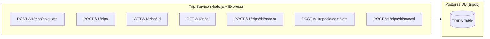
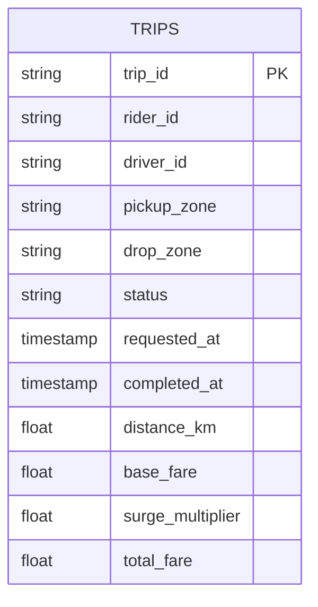
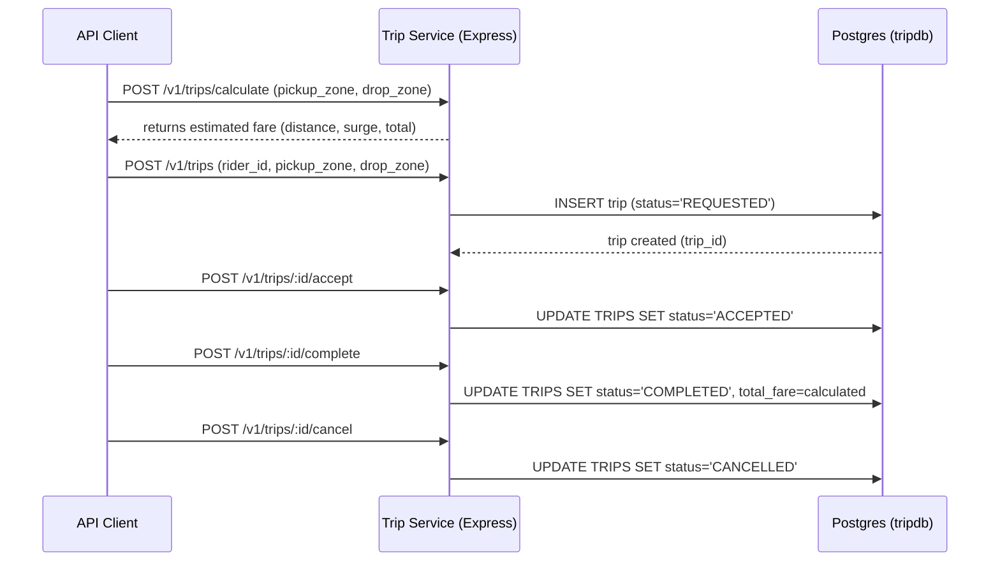

# group50-ridehail-trip-service

Trip Service that manages trip requests, driver assignment, status updates, and completion. Exposes a small REST API under /v1/trips.

## Steps

- Run locally:
  - node index.js
- With Docker Compose:
  - docker-compose up --build

## Environment

- PORT (default 3000)

## Database schema

Trips table
Columns are trip_id ,rider_id, driver_id , pickup_zone, drop_zone, status, requested_at, distance_km, base_fare, surge_multiplier, total_fare

Drivers_snapshot table
driver_id, name, phone, vehicle_type , vehicle_plate, is_active

## API

Base: http://localhost:3000/v1/trips

- GET /v1/trips

  - Description: List trips (returns empty array if none)
  - Response: 200 { "data": [ ... ] }

- GET /v1/trips/:id

  - Description: Get a single trip
  - Response:
    - 200 { "data": {...} } if found
    - 404 { "error": "Trip not found" } if missing

- POST /v1/trips

  - Description: Create a trip
  - Required JSON body:
    {
    "rider_id": 1000,
    "pickup_zone": "HYD",
    "drop_zone": "KP"
    }
  - Responses:
    - 201 { "message": "Trip created successfully", "data": {...} }
    - 400 { "error": "rider_id, pickup_zone and drop_zone are required" }

- POST /v1/trips/:id/accept

  - Description: Accept a trip (driver accepted)
  - Returns 200 with updated trip or appropriate 400/404

- POST /v1/trips/:id/complete

  - Description: Mark trip completed
  - Returns 200 with updated trip or appropriate 400/404

- POST /v1/trips/:id/cancel
  - Description: Cancel trip; body may include cancellation_fee
    { "cancellation_fee": 10.5 }
  - Returns 200 with updated trip or appropriate 400/404

- POST /v1/trips/calculate
  - Description: Calculate the trip fare based on the provided trip distance (in kilometers). This endpoint performs a simple fare calculation using: A fixed base fare, A per kilometer rate, A dynamic surge multiplier depending on the time of day
  - This endpoint does not store data in the database
  - Body Parameters: distance_km
  - Response example: {
  "data": {
    "distance_km": 12.5,
    "base_fare": 50,
    "per_km_rate": 10,
    "surge_multiplier": 1.2,
    "estimated_fare": "204.00",
    "currency": "INR"
  }
}

## PostgreSQL Setup Guide
Docker & Docker Compose installed and .env should have necessary values
  ## Start Postgres and Trip Service
  docker compose up -d
  ## Enter the Postgres Container
  My db name is tripdb
  docker exec -it trip-postgres psql -U postgres -d tripdb
  ## Trip table schema
  CREATE TABLE IF NOT EXISTS trips (
  trip_id SERIAL PRIMARY KEY,
  rider_id INT,
  driver_id INT,
  pickup_zone VARCHAR(255),
  drop_zone VARCHAR(255),
  status VARCHAR(50),
  requested_at TIMESTAMP DEFAULT NOW(),
  distance_km NUMERIC,
  base_fare NUMERIC,
  surge_multiplier NUMERIC,
  total_fare NUMERIC
);

## -- Drivers Snapshot Table for testing
CREATE TABLE IF NOT EXISTS drivers_snapshot (
  driver_id SERIAL PRIMARY KEY,
  name VARCHAR(100),
  phone VARCHAR(20),
  vehicle_type VARCHAR(50),
  vehicle_plate VARCHAR(20),
  is_active BOOLEAN
);

## Architecture

## Entity Relationship Diagram

## Trip Workflow (Independent workflow not considering other microservices)
